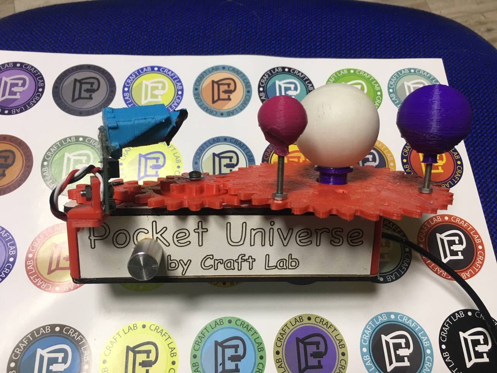
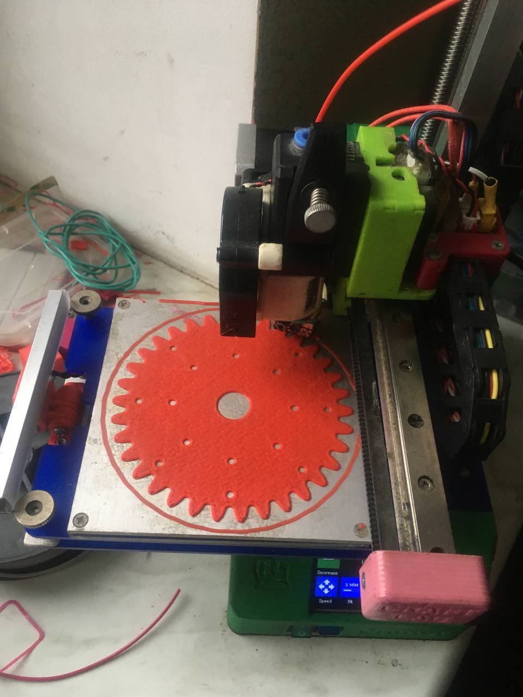

## 2024 NASA Space Apps Challenge

### Team: Craft Lab
### Challenge: Chronicles of Exoplanet Exploration
### Project: POCKET UNIVERSE - a simple DIY solution for styding exoplanet detectiob methods
### demo link: https://youtu.be/TQkwvJ_T5BM

## HIGH-LEVEL SUMMARY

We have developed a simple, reliable, low-cost DIY solution for demonstrating the transitive exoplanet detection method. Our hardware solution is designed for both beginners and advanced researchers. Any school or university teacher or an enthusiastic teenager can print out the developed model, use an affordable Arduino controller and the software we created to watch how exoplanets were discovered using the Kepler telescope. Exoplanet research begins with methods for finding them, so the importance of our development is difficult to overestimate. The use of our project is diverse: from its direct purpose to demonstrate the transitive exoplanet detection method, to demonstrating eclipses, or using it in STEM education.

## PROJECT ACHIVEMENTS

- hardware 3d-printable construction (https://a360.co/4eonZ61)
- basic software for Arduino (https://github.com/TechnoPreacher/nasa2024/blob/main/project.ino)

## PROJECT COMMON GENESIS

We want to develop DIY hardware educational system for exoplanet exploration;
We find? that the transition method is the best for our goal;
The principle of transition method is the Brightness-time dependencies for exoplanet which rotate along it star:

  

We make with Fusion360 3d-models and print it in our own 3D-printer "Crafter"

Assembled and powered by Arduino with micro servo, adress led, photoresistor:

Make some test, "telescope" correction and code improvements for better results. With Kalman filter in code and vertical diaphragm in hardware we deal with it:

Oh, eah! We made first prototype with bigger size previously:

It have better curves:

But this prototype have been more expencive, that is why we go to the smaller sizes. We think that we can find ballance between cost and properties :-).

## ABOUT US

Craft Lab - Odessa R&D laboratory, whose main expertise is 3D printing and robotics, offers its own developments for the education, creativity and technocratic community (startups, makers).
The founding father of Craft Lab is Nikolai Sulima, who calls himself a technical preacher, but the existence and development of the laboratory would be impossible without the second pilot, “twin brother” Artem Zhurba. And if the first is a settled PhD, the second is a rising star of graduate school and a future luminary of science and technology.

### PER ACTUM EST. AMEN

